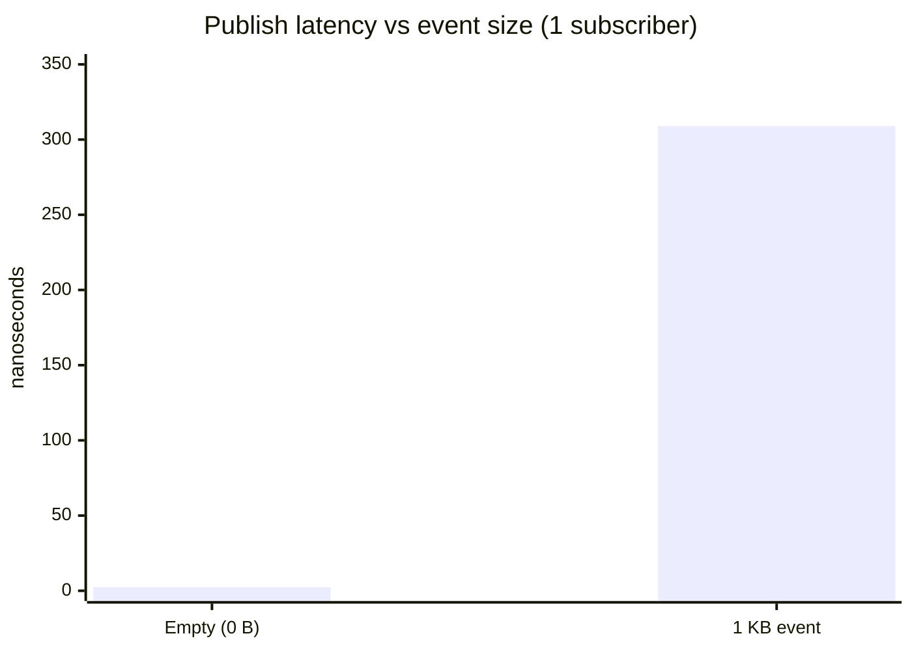
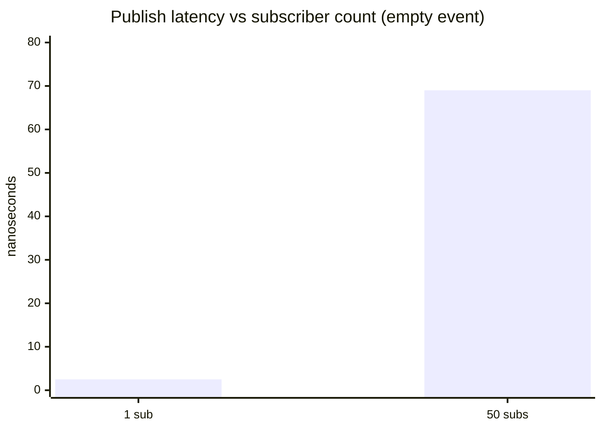
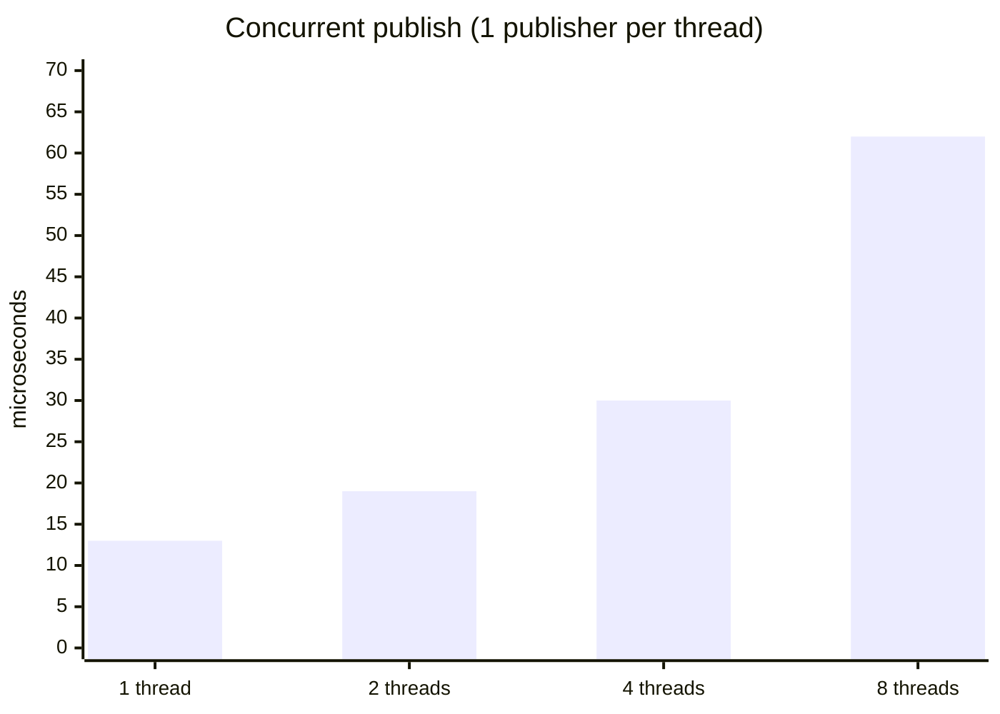
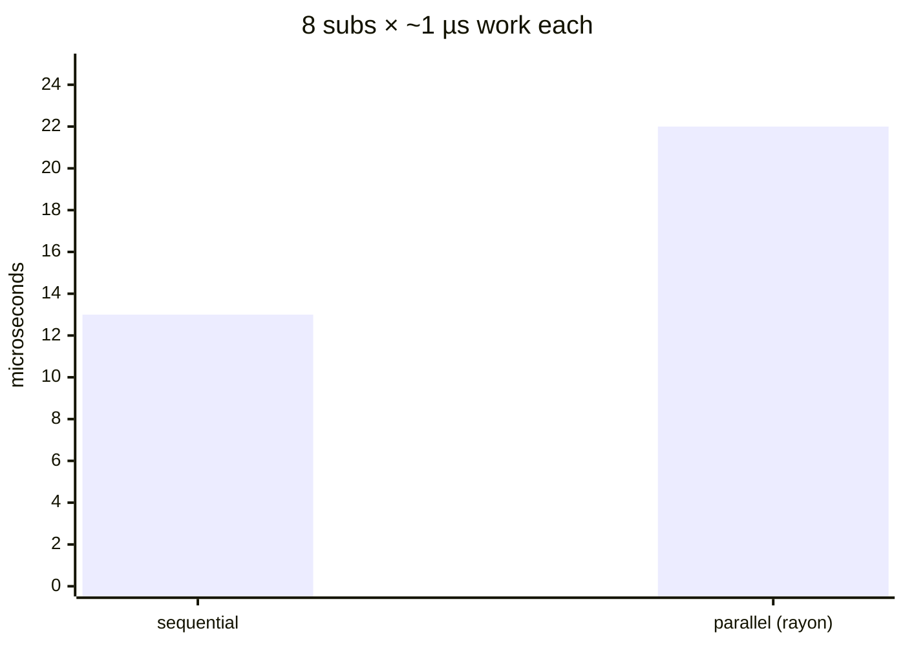

# Pulsar Gamma

A **DLL‑safe, data‑driven event system** for Rust plugin architectures.

Gamma lets the host and dynamically‑loaded plugins exchange events safely
even when they are compiled with different compiler versions, optimisation
levels, or feature flags.

## Architecture

```
gamma-core   ──► Event trait, EventBus, EventHandler
gamma-derive ──► #[pulsar_event] — single‑attribute event definition
gamma          ─► Umbrella crate that re‑exports both
```

## Usage

```toml
[dependencies]
gamma-core = "0.1"
gamma-derive = "0.1"
```

Or use the umbrella crate:

```toml
[dependencies]
gamma = { git = "https://github.com/Far-Beyond-Pulsar/gamma" }
```

### Example

```rust
use gamma_core::EventBus;
use gamma_derive::pulsar_event;

#[pulsar_event]                        // ← adds #[repr(C)] + implements Event
struct PlayerJumped {
    height: f32,
    timestamp: u64,
}

let mut bus = EventBus::new();

// Subscribe
bus.subscribe(|e: &PlayerJumped| {
    println!("Jumped {} at {}", e.height, e.timestamp);
});

// Publish
bus.publish(PlayerJumped { height: 5.0, timestamp: 12345 });
```

The same pattern works across a DLL boundary — the stable type ID
(`Event::stable_type_id()`) ensures that a plugin's event matches the
host's subscriber.

## DLL‑safety checklist

| Requirement | What does it? |
|---|---|
| [`#[pulsar_event]`](https://docs.rs/gamma-derive/latest/gamma_derive/attr.pulsar_event.html) | Applies `#[repr(C)]` **and** generates a deterministic `stable_type_id()`. No manual attributes needed. |
| Shared global allocator | `Box<dyn EventHandler>` created in one compilation unit may be dropped in another. Link the same allocator globally (e.g., `mimalloc` or `jemalloc`) to avoid allocator mismatches. |
| Versioning (optional) | If you plan to evolve event structs at runtime, add a `VERSION` constant to your event type and include it in `stable_type_id()`. |

## Crate structure

| Crate | Purpose |
|---|---|
| `gamma-core` | `Event` trait, `EventBus`, internal `EventHandler` — no dependencies beyond `std`. |
| `gamma-derive` | `#[pulsar_event]` attribute macro and `#[derive(Event)]` derive macro. |
| `gamma` (root) | Umbrella crate re‑exporting both. Use `use gamma::prelude::*;` for convenience. |

## Performance

Benchmarks on Apple M3 (8 cores), `cargo bench -p gamma-core --features parallel`.

### Scaling with payload size

Larger events cost proportionally to their size (copy into the bus). The dispatch
overhead itself is negligible.



### Scaling with subscriber count (single-threaded `EventBus`)

Dispatch is O(n) — each additional no-op subscriber adds ~1.4 ns of overhead.



### Concurrent publishers (`SyncEventBus`)

Multiple threads calling `publish()` on the same bus with `SyncEventBus` scale
linearly — the `RwLock` read-lock shows negligible contention.



### Parallel dispatch (`parallel_publish` with rayon)

`parallel_publish` uses a warm thread pool (opt-in via `features = ["parallel"]`).
Without the feature it falls back to `std::thread::scope` (~6× slower).

```mermaid
xychart-beta
    title "Parallel dispatch overhead (no-op handlers)"
    x-axis ["2 subs", "4 subs", "8 subs"]
    y-axis "microseconds" 0 --> 65
    bar "std::thread::scope" [18, 30, 60]
    bar "rayon (thread pool)" [9, 10, 10]
```



**With real work (8 subscribers, ~1 µs each):**



Rayon beats sequential when **each handler exceeds ~2 µs** (for 8 subs).
The crossover scales with subscriber count: 4 subs need ≈4 µs, 16 subs ≈1 µs.

### Summary

| Scenario | Throughput | Bound by |
|---|---|---|
| Publish, 1 sub, empty event | **400 M / sec** | RwLock read (5 ns) |
| Publish, 1 sub, 1 KB event | **3.2 M / sec** | Memory bandwidth |
| Publish, 50 subs, no-op | **14 M / sec** | Dispatch loop |
| Concurrent publish, 8 threads | **120 M / sec** | Thread scheduling |
| Parallel dispatch (rayon), 8 subs, 10 µs work | **190 M ops / sec** | CPU cores |

## Why not just use `TypeId`?

`TypeId::of::<T>()` is **not** stable across compilation units. Two separate
`rustc` invocations may assign different `TypeId` values to the same type.
Gamma replaces this with a deterministic hash that is:

- Computed from the type's **name**, **size**, and **alignment**
- Identical for the same struct compiled in different crates
- Different for structs with the same name but different field layouts

## License

Gamma is distributed under the [MIT License](LICENSE).
